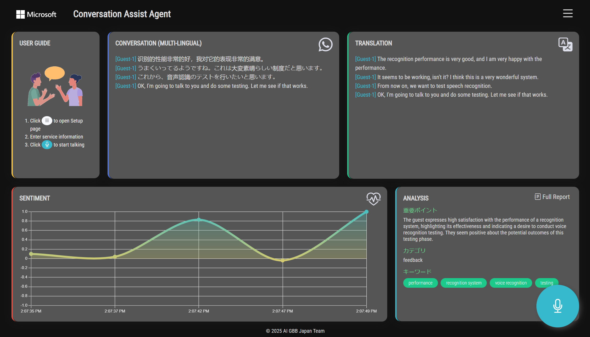
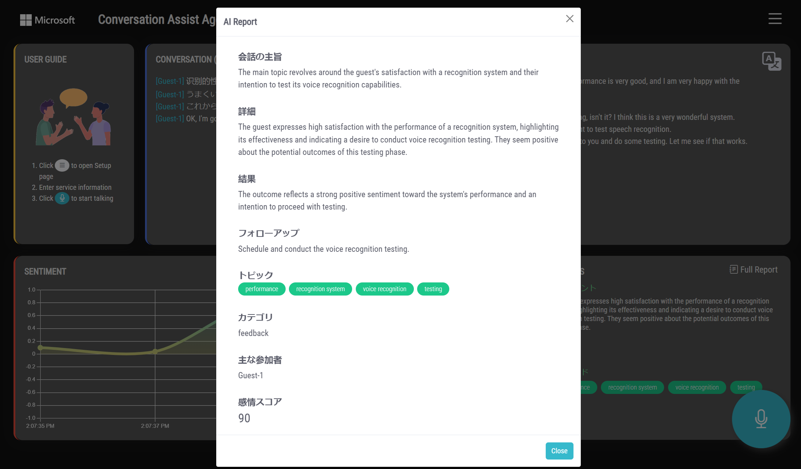

## Contact Center AI Solution with GPT

This solution demonstrates the application of Microsoft AI and GPT to help solve challenges common to contact center scenarios

Author:     Jixin Jia (Gin)     
Updated:    2025/04/01   
Version:    3.0

<hr>
<br>

## Change log

Version 1.0 
- Initial release    

Version 2.0 
- Updated to use `Conversation Transcriber` for speaker diarization
- Introduced OpenAI GPT-3 Davinci for `Conversation Analysis`

Version 3.0 
- Upgraded to Azure OpenAI `Responses API`
- Introduced Dark theme
- Simultaneous `multi-lingual recognition` (English, Japanese, Mandarin, Korean, French, Spanish and German)
- More detailed conversation analysis report
- Introduced `Azure AI Translator` for realtime text translation
- Introduced `Japanese UI` accessible via `/jp`

<br>

## Key Features  

1. `Transcribe` conversations in real-time with auto language detection.
2. `Translate` into multiple languages of choice.
3. Speaker separation by `diarizing` the conversation.
4. Analyze `sentiment` and plot onto real-time chart.
5. `Summarize`conversation and get insights on key topics discussed.

<br>

## About    

* This app runs on a single instance of `Gunicorn` for demo purpose.

* All API calls is procesed within your browser. No key data is transmitted outside your locally hosted Flask server.

* Following Azure AI services are used to run this demo:

| Purpose| Services|
|----|----|
| For performing live speech-to-text, speaker diarization,  translation and sentiment analysis | `Azure AI Services`, `Azurre AI Text Translation`, `Azure OpenAI`|

<br>

## See it in action

Dark theme



AI generated report




<br>

## Setup Guide

### 0. Install

Install dependencies. This solution has been tested on `Python 3.7~3.10`

```python
pip install -r requirements.txt
```

<br>

### 1. Run the app

For Unix:

```bash
./run.sh
```

For Windows:

```cmd
waitress-serve --listen=0.0.0.0:80 wsgi:app
```

<br>

### 2. Open your favorite browser

Type following in address bar:    
`localhost:80`

<br>

### 3. Add keys into Setup page


<br>

### 4. Press mic button and start talking to it


Enjoy the demo !

<br>

## Credit

Special thanks to [Nobu Tanahashi](https://github.com/notanaha) for his ingenious Conversation Transcription source code and idea used in this demo.
