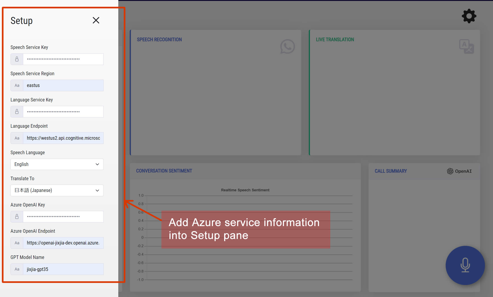
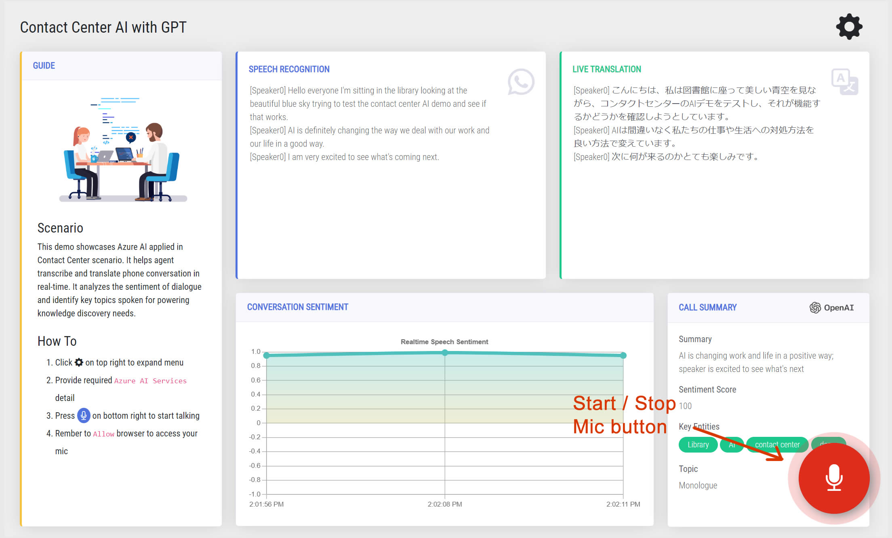

## Contact Center AI Solution with GPT

This solution demonstrates the application of Microsoft AI and GPT to help solve the challenges of contact center scenarios

Author:     Jixin Jia (Gin)     
Created:    2023/03/01    
Version:    1.4
  
<hr>

## About    

* This WSGI demo app runs on single instance of Gunicorn for production workload. It is recommended to build it on a docker orchestration service if you target a more scalable workload.

* All transaction runs within browser (client end). There are no data transmitted to or stored at the backend server in this demo.

* To run the demo following Azure services must be provisioned and provided at run time:

|Azure resource| Purpose| Required information|
|----|----|----|
|Cognitive Service Speech Services| For live speech-to-text, speaker diarization and translation | `key`, `endpoint`, `spoken language`, `translate target langage`|
|Cognitive Service Language Services| For real-time sentiment scoring and key named entity recognition | `key`, `endpoint`|
|Azure OpenAI Service| For generating call summary and assign a topic to the transcribed call | `key`, `endpoint`, `deployed gpt model name`|

<br>

## See it in action


<br>

## Setup Guide

### 0. Install

Install dependencies. This solution is tested on `Python 3.7+`

```python
pip install -r requirements.txt
```

### 1. Run the app

For Unix:

```bash
./run.sh
```

For Windows:

```cmd
waitress-serve --listen=0.0.0.0:80 wsgi:app
```

<br>

### 2. Open your favorite browser

Type following in address bar:    
`localhost:80`

<br>

### 3. Add keys into Setup page



<br>

### 4. Press mic button and start talking to it




Enjoy the demo !
